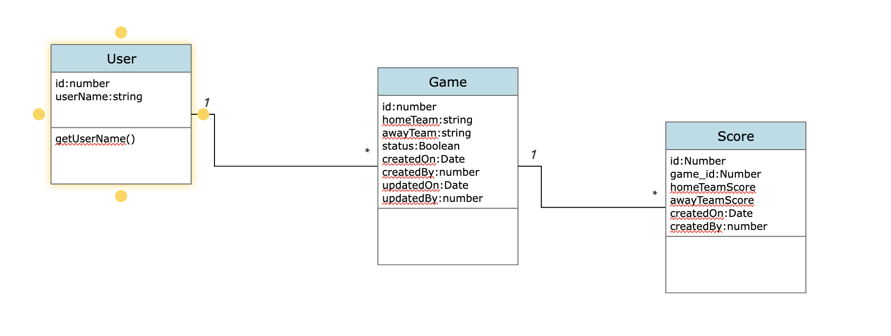

# Football World Cup Score Board.

##  User Story  

    You are working on a sports data company, and we would like you to develop a new Live
    Football World Cup Score Board that shows matches and scores.
    The board supports the following operations:
        1. Start a game. When a game starts, it should capture (being initial score 0 – 0):
            a. Home team
            b. Away team
        2. Finish game. It will remove a match from the scoreboard.
        3. Update score. Receiving the pair score; home team score and away team score updates a game score.
        4. Get a summary of games by total score. Those games with the same total score will be returned ordered by the most recently added to our system

## Functional requirement  and Use case 

    1. User can able to view live scoreboard (maches and scores).
    2. User can able to start a game with score (0-0).
    3. User can able to stop the active game from the scoreboard. 
    4. User can able to get the summery of games by total score. 
  
### Display Criteria for total score 

    Those games with the same total score will be returned ordered by the most recently added to our system.

## Refrence class Digarm 

   

## Technology 
     
     Framework - @angular/cli - ~13.3.1 and @angular/core: 13.3.0
     TDD - Jasmine and Karma 
     Runtime - Node v16.14.2

### Use Cases Priority 

    -  User can able to start a game with score (0-0).
    -  User can able to view live scoreboard (maches and scores).
    -  User can able to stop the active game from the scoreboard. 
    -  User can able to get the summery of games by total score. 
    

    
